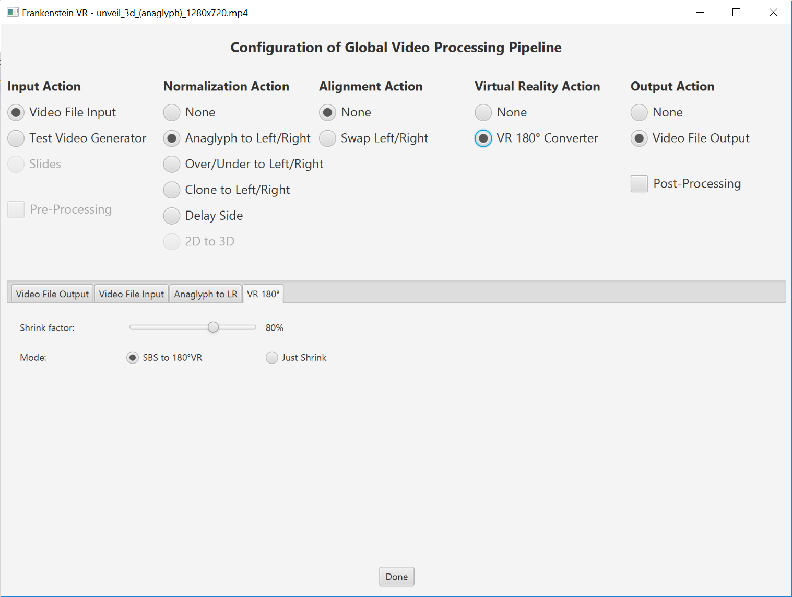
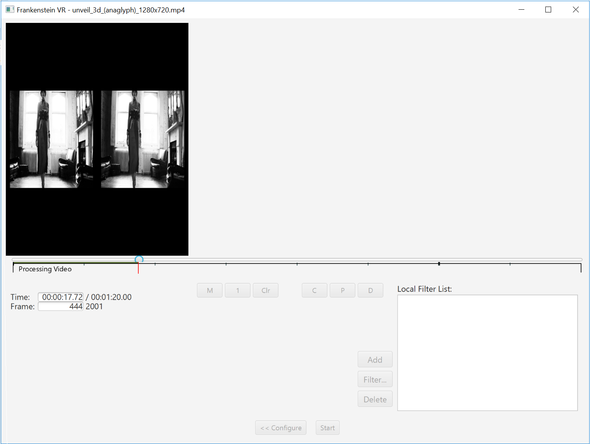

# Frankenstein VR
Free Video Converter for Virtual Reality and 3D based on ffmpeg and OpenCV for Java.
It can convert side-by-side 3D videos to videos for VR display.

 

## Screenshots
  
 

## Samples
I have uploaded some samples to: [vimeo](https://vimeo.com/user68089135)

## Status
No release yet. Plattforms: Windows (Developed/Tested on a Windows 10 64bit.)

You can use maven to run it with "mvn clean package exec:exec"

## Issues:
- Temporary video output is uncompressed and can get very hugh. You need to have at least 100GB disk space. 
- Video editing / local filters is under construction

# Pre-Requisites
- [FFmpeg 3.1.1+](https://java.com) installed. Select path at first startup (is stored in frankenstein.ini at user-home)
- [Java JRE 1.8+](https://ffmpeg.org) installed.
# Provided (do not install)
- [OpenCV 3.2.0+](http://www.opencv.org/releases.html)

## Summary for Users
Frankenstein VR is an experimental video converter with some video filters/features:
- Virtual Reality side-by-side converter (projection, padding, shrinking)
- Anaglyph (e.g. red/blue) to grayscale side-by-side converter
- Over/Under to Left/Right (side-by-side) converter
- Left/Right side swapper
- Test Image (good for calibrating configurations on a VR display)
Some filters can be chained together.
The output of Frankenstein VR can be perfectly viewed in 3D with video players like [LittlStar](http://littlstar.info). It appears on a virtual 160-inch curved display.

## Summary for Programmers
If you like to experiment with video filters based on OpenCV just fork it.
It is a very small and easy to extend Java Tool with JavaFX frontend. 
Uncompressed temporary video makes it a little bit slow, but the rest of it is pretty fast because it is mostly build on existing libraries: OpenCV for graphic processing and ffmpeg for video/audio processing. The Graphical Interface (Java FX) is optional. It was a little bit tricky to get the toolchain working with acceptable quality. 

But now... It's alive!

### FFMPEG OpenH264 support ###
FFMPEG build contains H264 encoder based on the OpenH264 library, that should be installed separatelly.
  OpenH264 Video Codec provided by Cisco Systems, Inc.
  See https://github.com/cisco/openh264/releases for details and OpenH264 license.
  Downloaded binary file can be placed into global system path (System32 or SysWOW64) or near application binaries (bin/).
  You can also specify location of binary file via OPENH264_LIBRARY_PATH environment variable.
