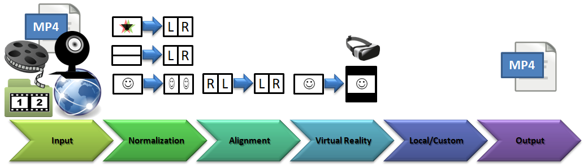
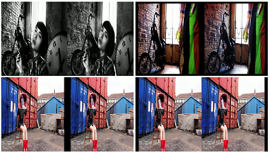

# Frankenstein VR
Free Video Converter for Virtual Reality and 3D based on ffmpeg and OpenCV for Java.
It's a small, open-source platform for OpenCV-based video filtering, where custom filters can be simply added into the processing pipeline:

When you work on custom filters, you can concentrate on manipulating images with the OpenCV library. 
For a list of available filters and HOWTO see [SegmentFilters.md](https://github.com/olir/Frankenstein/blob/master/doc/SegmentFilters.md).

The pipeline allows input as video file, camera, network stream or pictures stored as left/right 3D slides (e.g. from nikon camera).

So Frankenstein VR can e.g. be used to convert anaglyph or side-by-side 3D videos for VR display,
 and the output video can be perfectly viewed in 3D with VR Hardware and a video players like [LittlStar](http://littlstar.info). 
VR videos appear like displayed on a virtual 160-inch curved 3D display in front of you.

3D is optional. Hence, Frankenstein VR can be used solely for classic video processing. It focuses on filters, that are not part of common tools.

## Screenshots
 

## Samples
I have uploaded some samples to vimeo: 

## Status

 

Latest Release: 0.1 - Windows only (Developed/Tested on a Windows 10 64bit)

Master branch (0.2): Cam and network stream support.

For current or full status see [Release Notes](https://github.com/olir/Frankenstein/blob/master/doc/RELEASE-NOTES.md). 

Install Pre-Requisites first (see below), then you have 3 options to start it:
* _Jar execution:_ Download and execute the jar file from the release (see section below) 
* _Java Webstart:_ You can execute releases with Java Webstart (see section below) 
* _From Maven:_ For the current version, use maven and run it in app folder with "mvn clean package exec:exec"

# Pre-Requisites
- [FFmpeg 3.1.1+](https://ffmpeg.org) installed. Select path at first startup (is stored in frankenstein.ini at user-home)
- [Java JRE 1.8+](https://java.com) installed.
- [VLC 2.2.8](https://mirror.de.leaseweb.net/videolan/vlc/2.2.8/) installed for network stream recording support.
# Provided (do not install)
- [OpenCV 3.2.0+](http://www.opencv.org/releases.html)

## Summary for Users
Frankenstein VR is an experimental video converter with some video filters/features:
- Virtual Reality side-by-side converter (projection, padding, shrinking)
- Anaglyph (e.g. red/blue) to grayscale side-by-side converter
- 3D Slideshow (SBS Video from 3D image pairs; see [samples](doc/slides) )
- Over/Under to Left/Right (side-by-side) converter
- Left/Right side swapper
- Test Image (good for calibrating configurations on a VR display)
Some filters can be chained together.

## Summary for Programmers
If you like to experiment with video filters based on OpenCV just fork it.
It is a very small and easy to extend Java Tool with JavaFX frontend. 
Uncompressed temporary video makes it a little bit slow, but the rest of it is pretty fast because it is mostly build on existing libraries: OpenCV for graphic processing and ffmpeg for video/audio processing. The Graphical Interface (Java FX) is optional. It was a little bit tricky to get the toolchain working with acceptable quality. 

But now... It's alive!

### FFMPEG OpenH264 support ###
FFMPEG build contains H264 encoder based on the OpenH264 library, that should be installed separatelly.
  OpenH264 Video Codec provided by Cisco Systems, Inc.
  See https://github.com/cisco/openh264/releases for details and OpenH264 license.
  Downloaded binary file can be placed into global system path (System32 or SysWOW64) or near application binaries (bin/).
  You can also specify location of binary file via OPENH264_LIBRARY_PATH environment variable.

### Start via Java Webstart (Windows only)
(Under construction... need to fix some provileges to write files)
1. Install the pre-requistes above
- Go to Security tab within the Java Control Panel (Help: https://java.com/en/download/help/jcp_security.xml). 
  You have to add github as site exception: https://github.com/olir/Frankenstein/releases/download/0.1/
2. Download & Open jnlp file from release:
  - e.g.: [Pre-Release 0.1](https://github.com/olir/Frankenstein/releases/download/0.1/launch.jnlp)
3. Accept warnings and execute.

