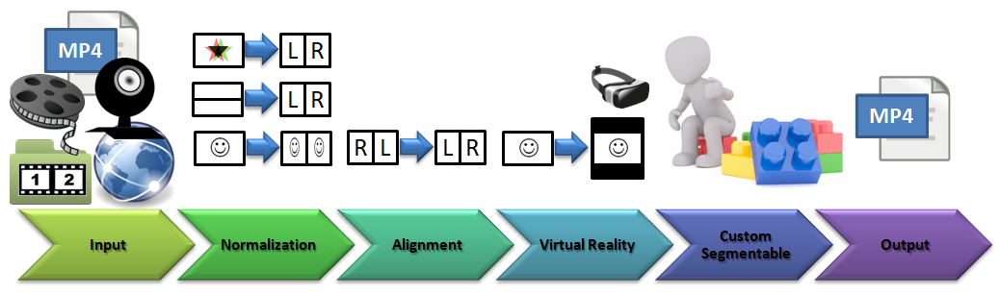

# Frankenstein VR
A Video Stream Analysis and Manipulation Framework for Java™ and C++, where custom filters can be simply added into the processing pipeline.

The Tool supports 
* [OpenCV](http://www.opencv.org/releases.html) - computer vision and machine learning
* [JogAmp (OpenGL®, OpenCL™, OpenAL)](http://jogamp.org) - 3D Graphics, Multimedia and Processing
* [FFmpeg](https://ffmpeg.org) - record, convert and stream audio and video.
* [VLC](https://www.videolan.org/vlc/) - video stream recording

## Screenshots
 

## Samples
I have uploaded some samples to vimeo: 

## Features and video filters in the main pipeline
- Virtual Reality side-by-side converter (projection, padding, shrinking)
- Anaglyph (e.g. red/blue) to grayscale side-by-side converter
- 3D Slideshow (SBS Video from 3D image pairs; see [samples](https://github.com/olir/Frankenstein/tree/master/doc/slides) )
- Over/Under to Left/Right (side-by-side) converter
- Left/Right side swapper
- Test Image (good for calibrating configurations on a VR display)

### 3D / VR Features
The pipeline allows input as video file, camera, network stream or pictures stored as left/right 3D slides (e.g. from nikon camera). Frames can be converted tp anaglyph or side-by-side 3D videos for VR display, and the output video can be perfectly viewed in 3D with VR Hardware and a video players like [LittlStar](http://littlstar.info). VR videos appear in this viewer like displayed on a virtual 160-inch curved 3D display in front of you.

# HOWTO run it
Install Pre-Requisites first (see below), then you have 3 options to start it:
* _From Maven:_ For the current version, use maven and run it in app folder with **mvn -pl .,app clean package exec:exec**
* _Jar execution:_ Download and execute the jar file from the release (see section below) 
* _Java Webstart:_ You can execute releases with Java Webstart (see section below) 

## Pre-Requisites
- [FFmpeg 3.1.1+](https://ffmpeg.org) installed. Select path at first startup (is stored in frankenstein.ini at user-home)
- [Java JRE 1.8+](https://java.com) installed.
- [VLC 2.2.8](https://mirror.de.leaseweb.net/videolan/vlc/2.2.8/) installed for network stream recording support.
- Codecs. See section below.

### FFMPEG OpenH264 support ###
FFMPEG build contains H264 encoder based on the OpenH264 library, that should be installed separatelly.
  OpenH264 Video Codec provided by Cisco Systems, Inc.
  See https://github.com/cisco/openh264/releases for details and OpenH264 license.
  Downloaded binary file can be placed into global system path (System32 or SysWOW64) or near application binaries (bin/).
  You can also specify location of binary file via OPENH264_LIBRARY_PATH environment variable.

### Start via Java Webstart (Windows only)
(Under construction... need to fix some provileges to write files)
1. Install the pre-requistes above
- Go to Security tab within the Java Control Panel (Help: https://java.com/en/download/help/jcp_security.xml). 
  You have to add github as site exception: https://github.com/olir/Frankenstein/releases/download/0.1/
2. Download & Open jnlp file from release:
  - e.g.: [Pre-Release 0.1](https://github.com/olir/Frankenstein/releases/download/0.1/launch.jnlp)
3. Accept warnings and execute.

## For developers ##
When you work on custom filters, you can concentrate on manipulating images with the OpenCV or JogAmp libraries. 
For more details read [SegmentFilters](https://olir.github.io/Frankenstein/doc/SegmentFilters.html).

